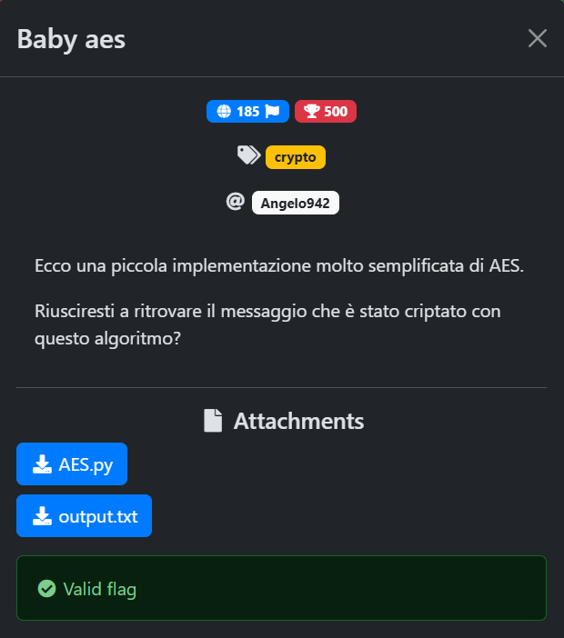

<!-- CTF Name -->
<div align="center">
  
</div>


### 📌 Challenge Details
- **CTF:** Baby aes 
- **Category:** Crypto 🔑<!-- [Crypto / Web / Pwn / Forensics / Misc] -->
- **Points:**  N/A
- **Difficulty:** Easy <!-- [Easy / Medium / Hard] -->
- **Date:** 21-09-2025    

---

### 📝 Challenge Description
The challenge, as the name implies, is a simplified — and deliberately insecure — implementation of the AES block cipher operating in Electronic Code Book (ECB) mode. In particular, _Baby aes_ omits some of AES’s standard round transformations (SubBytes, ShiftRows, MixColumns, AddRoundKey) and, to make matters worse, uses a key of only two bytes. That tiny keyspace can be trivially brute-forced — and it’s exactly this weakness that the challenge exploits.

<p align="center">
  
</p>

---

### 🧠 Thought Process
First, I examined the [cipher](BasbyAes.py) implementation. The S-box matches the standard AES S-box, so the vulnerability is unlikely to come from the S-box. I also noticed that the `ShiftRows` step has been altered — it behaves more like a `ShiftColumns` permutation. That permutation itself doesn’t seem to introduce the weakness, but I kept it in mind because it will be useful in the exploit. At this stage I glanced over the cryptographic routine:
```python
for block in blocks:
        block = xor_with_key(block, key_expanded)
        block = substitution(block)
        block = permutation(block)
        block = xor_with_key(block, key_expanded)
        ciphertext += block
```
At first I suspected the double XOR might cancel out, creating a weakness, but that’s not the case: the substitution/permutation stage between the XORs introduces non-linearity (notably the S-box), so the two XORs do not simply negate each other. Ultimately I concluded that the real weakness is the two-byte key — the keyspace is tiny, so brute-forcing it is feasible (and ultimately necessary) to recover the key.

Not the most fun approach, but sometimes brute force is the practical solution.

I hate brute-forcing challenges.

---

### 🔍 Solution
All steps used to solve the challenge are available in the [exploit](BasbyAes_Exploit.py). Below is a brief summary of the most important points:

- **Invert S-box**: I used the AES standard inverse S-box to reverse the substitution step.
- **Invert permutation**: I implemented the inverse of the modified `ShiftColumns` permutation to undo that transformation.
- **Keyspace**: The keyspace contains 256×256=65536 possible keys (integer values 0–65535), which makes brute-force feasible. 

<!-- ```bash
# Example command
nc example.ctf 1337 -->

---

### 🚩 Flag
```
flag{B3ll0_c0n_5oL0_uN_c1cLo}
```

---

### 📚 Tools & Resources

Tools used: `python3`.

Suggested resources:
- [Cryptography and Network Security: Principles and Practice - by William Stallings [Chapter 6]](https://mrce.in/ebooks/Cryptography%20&%20Network%20Security%208th%20Ed.pdf). A beautiful book for learning the inner workings of the AES cipher.

---

### 📈 Notes / Alternative Approaches

- N/A

---

### 📚 Lessons Learned

- **Don’t be fooled by a double XOR** — two XORs cancel each other out only if the operations between them are linear. Non-linear steps (e.g. an S-box) prevent cancellation.

---

### 🤝 Credits

- Challenge author(s): **Angelo942**

- Writeup by: **Giovanni Pascuzzi (Giunco171)**

- Inspired by / referenced: **N/A**
